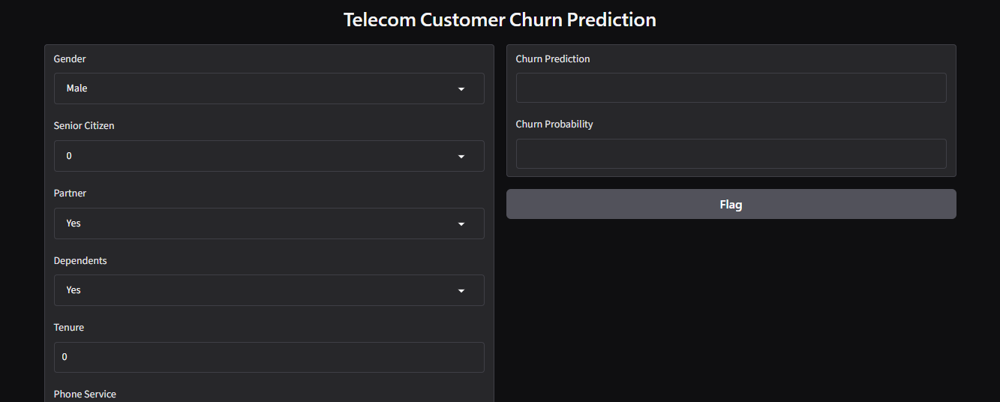
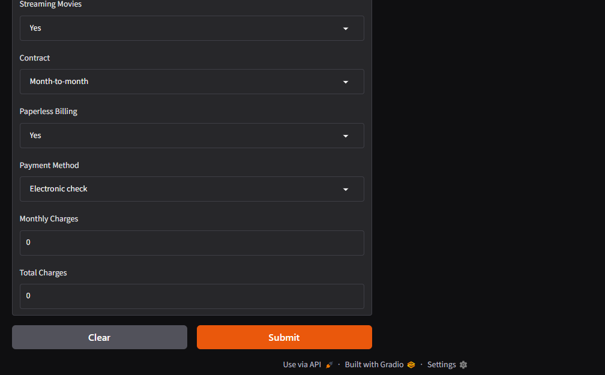

# Telecom Customer Churn Prediction

A machine learning project that predicts whether a telecom customer is likely to churn.

## Project Overview

This project uses customer demographic, service, contract, and billing information to predict customer churn.

## Machine Learning

- Problem: Binary Classification
- Model: Logistic Regression
- Target: Churn
- Evaluation: Accuracy, Precision, Recall, F1-score, ROC-AUC
- Class imbalance handled using `class_weight="balanced"`

## Technologies

- Python
- Pandas
- Scikit-learn
- Jupyter Notebook
- Gradio
- Git & GitHub

## Application

A Gradio web interface allows users to enter customer information and receive:

- Churn prediction
- Churn probability

## Project Structure

- `analysis.ipynb` — Data analysis, preprocessing, model training and evaluation
- `app.py` — Gradio application
- `telecom_churn_model.pkl` — Trained ML pipeline
- `.gitignore` — Ignored files

## Dataset

Telecom customer churn dataset obtained from Kaggle.

The dataset is not included in this repository.

## Result

The final model achieved approximately:

- Accuracy: 73%
- Churn Recall: 79%
- Churn F1-score: 0.61